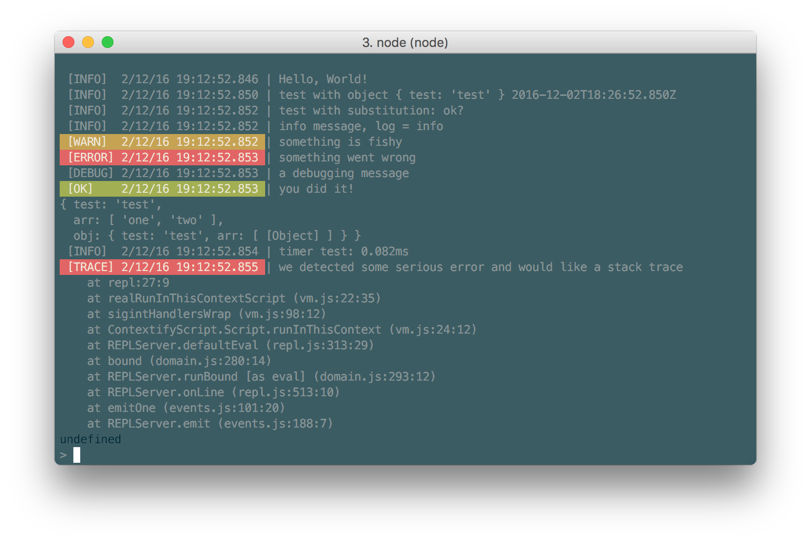

# formal-console
[](https://badge.fury.io/js/formal-console)
[](https://travis-ci.org/Juravenator/responsive-columns)
[](https://scrutinizer-ci.com/g/Juravenator/formal-console/?branch=master)
[](https://requires.io/github/Juravenator/formal-console/requirements/?branch=master)
[](http://opensource.org/licenses/MIT)

Extends console object to present a more useful log output by adding the log type, timestamp, and fancy colors.



Since this extends the console object, you only need to import & configure it once (probably in your main script) and you're good to go for the whole project.

## Usage

Install the module by executing `npm i -S formal-console`.

```js
var consoleConfig = require('formal-console');
console.log("Hello, World!");
console.log("test with object", {test: "test"}, new Date());
console.log("%s: %s", "test with substitution", "ok?");
console.info("info message, log = info");
console.warn("something is fishy");
console.error("something went wrong");
console.debug("a debugging message");
console.success("you did it!");
console.dir({
  test: "test",
  arr: [
    "one",
    "two"
  ],
  obj: {
    test: "test",
    arr: [
      {
        test: "test"
      }
    ]
  }
});
console.time("timer test");
console.timeEnd("timer test");
console.trace("we detected some serious error and would like a stack trace");
consoleConfig.disable('debug');
console.debug("debug output is disabled, this will do nothing");
consoleConfig.enable('debug');
```

## Custom output types


```js
var consoleConfig = require('formal-console');

// custom date formatting
consoleConfig.options.dateFormatter = date => date.toLocaleString();

// simple
consoleConfig.makeSimpleLogger("fancy");
console.fancy("fancy message");

// custom styling
var term = require('terminal-kit').terminal;
consoleConfig.makeSimpleLogger("❤️ ");
// The first style object is for the prefix, and is a terminal-kit object
// Optional: the second style object is for the message, and is
// consoleConfig.nativeLog or consoleConfig.nativeError
consoleConfig.options.styles.fancy[0] = term.bgMagenta.underline.yellow;
console["❤️ "]("even more fancy message");

// completely custom logic
consoleConfig.makeCustomLogger("fatal", function() {
  // reuse the standard prefix
  consoleConfig.printPrefix("FATAL", term.error.bgRed.underline.white);
  // log normally
  consoleConfig.nativeError.apply(this, arguments);
  // custom logic: trigger a crash
  process.abort();
});
console.fatal("we went too fancy ☹️");
```
